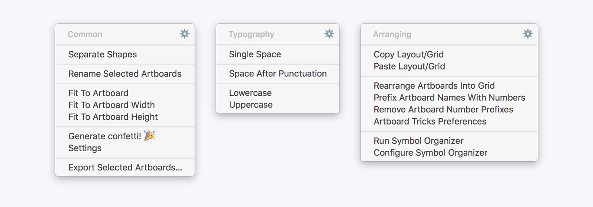
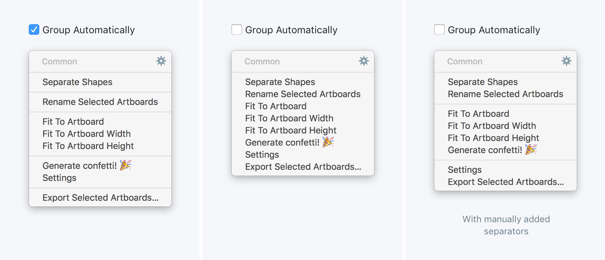

# Handy Menu Sketch Plugin
## Install

1. [Download](https://github.com/sergeishere/HandyMenu-SketchPlugin/archive/master.zip) the archive and unzip it.
2. Double-click the `HandyMenu.sketchplugin` to install the plugin.

## Configure
1. Open setting **Plugins → Handy Menu → Configure Handy Menu**.
2. Select the required plugins and drag them to the list (or double-click them). Don't forget to assign a shortcut to this collection.
3. Click **Save**.

## Use
Press the shortcut you assigned during configure state.

## Collections
You are able to create as many collections as you wish, rename them and assign different shortcuts.

## Grouping
By default commands in the menu are grouped automatically by the main plugin. But you can group them manually turning off the **Group Automatically** checkbox in **the settings**.

## Details

Feel free to send me your feedback and ideas: [Twitter](https://twitter.com/sergehere)
