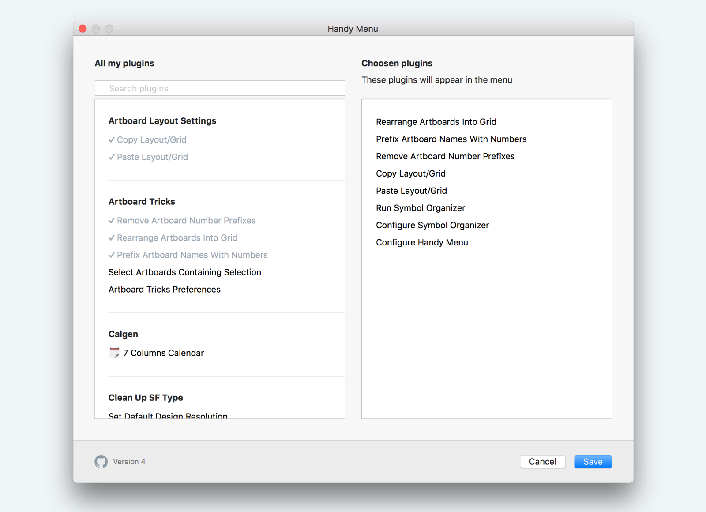

# Handy Menu Sketch Plugin
## Instalation

1. [Download](https://github.com/sergeishere/HandyMenu-SketchPlugin/archive/master.zip) the archive and unzip it.
2. Double-click the `HandyMenu.sketchplugin` to install the plugin.

## Usage

Just press `cmd` + `4`

#### Set up your list of commands

1. Open setting `Plugins` > `Handy Menu` > `Setup Handy Menu` or press `cmd` + `option` + 4
2. Choose commands you need quick access to using drag and drop.

## Details

Feel free to send me your feedback and ideas: [Twitter](https://twitter.com/sergehere)
